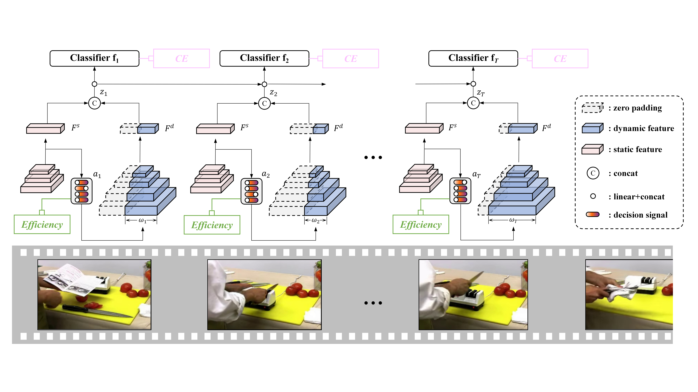

The implementation of paper **A Static-Dynamic Composition Framework for Efficient Action Recognition** acceptted by the *IEEE Transactions on Neural Networks and Learning Systems*.

Dynamic inference, which adaptively allocates computational budgets for different samples, is a prevalent approach for achieving efficient action recognition. Current studies primarily focus on a data-efficient regime that reduces spatial or temporal redundancy, or their combination, by selecting partial video data such as clips, frames, or patches. However, these approaches often utilize fixed and computationally expensive networks. From a different perspective, this paper introduces a novel model-efficient regime that addresses network redundancy by dynamically selecting a partial network in real time. Specifically, we acknowledge that different channels of the neural network inherently contain redundant semantics either spatially or temporally. Therefore, by decreasing the width of the network, we can enhance efficiency while compromising the feature capacity. To strike a balance between efficiency and capacity, we propose the Static-Dynamic Composition (SDCOM) framework, which comprises a static network with a fixed width and a dynamic network with a flexible width. In this framework, the static network extracts the primary feature with essential semantics from the input frame and simultaneously evaluates the gap toward achieving a comprehensive feature representation. Based on these evaluation results, the dynamic network activates a minimal width to extract a supplementary feature that fills the identified gap. We optimize the dynamic feature extraction through the employment of the slimmable network mechanism and a novel meta-learning scheme introduced in this paper. Empirical analysis reveals that by combining the primary feature with an extremely lightweight supplementary feature, we can accurately recognize a large majority of frames (76\% - 92\%). As a result, our proposed SDCOM significantly enhances recognition efficiency. For instance, on ActivityNet, FCVID and Mini-Kinetics datasets, SDCOM saves 90\% of the baseline's FLOPs while achieving comparable or superior accuracy when compared to state-of-the-art methods.

## Approach



## Requirements
Our code has been tested on Ubuntu16.04 using python3.6, Pytorch version 1.4.0 with four NVIDIA Tesla V100 cards.

## Run on ActivityNet
Please prepare the data and modify the corresponding directories in the config files first.
For the data preparation, please download the videos from the [official website](http://activity-net.org/) and set the `DATA_TYPE` in the config file as 'video' if you use raw videos.

```
# Train supernet
python train.py --cfg exp_configs/anet.yaml

# Train policy net
python train.py --cfg exp_configs/anet-policy.yaml

# Test
python train.py --cfg exp_configs/anet-eval.yaml
```
For other datasets, please follow the same instructions and change the name of config files.

